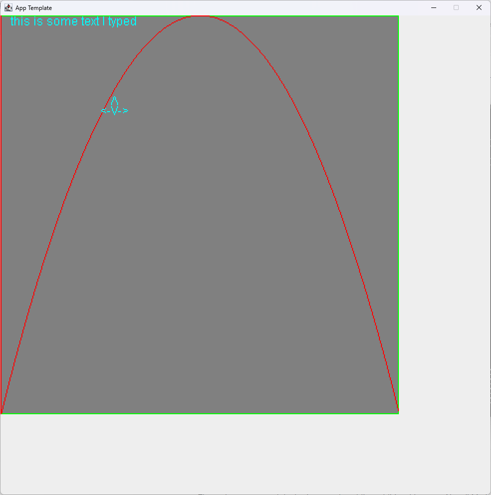

# Bare Minimum Java Template App

This is an app template written in pure Java without the use of any GEN-AI, IDE or even a build system like maven or ant. Instead, a combination of Notepad++ and simplistic batch scripts was used.

The code also only uses libraries from the javax.swing, java.awt and java.util packages. With this, it should be possible to compile and run on more exotic hardware like for example an iMac G3.

## Features

- Templates for:
	* Custom rendering
	* Mouse input
	* Keyboard input
	* An animation system
- Clean and portable java code

## Screenshots

## Building

### Requirements
Java compiler & runtime installed

### Windows
Run `full.bat` in your terminal to get an executable jar file.

### Linux & Mac OS X
Run `./build.sh full` in your terminal to get an executable jar file.
